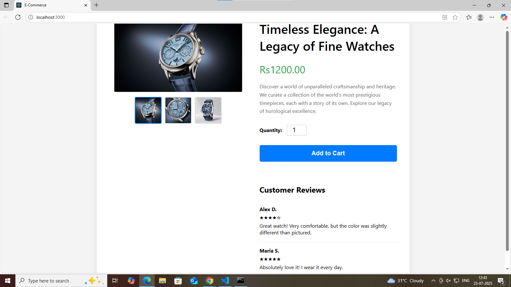

# React Product Page for E-Commerce

This project is a simple but functional e-commerce product page built with React. Its primary purpose is to serve as a demonstration piece for a Software Quality Analyst (SQA) interview process.

The application was intentionally built with several common bugs—spanning UI, functionality, and logic—to showcase a comprehensive testing strategy.



## Key Features

*   **Product Image Gallery**: Displays a main product image and several thumbnails.
*   **Product Details**: Shows the product title, price, and a descriptive paragraph.
*   **Quantity Selector**: An input field to allow users to specify the number of items.
*   **Add to Cart Button**: A button with dynamic states (e.g., disabled/enabled).
*   **Customer Reviews**: A static section displaying sample customer feedback.

## Tech Stack

*   **Frontend**: [React.js](https://reactjs.org/)
*   **Styling**: Plain CSS3
*   **Testing**: [Jest](https://jestjs.io/) & [React Testing Library](https://testing-library.com/)

---

## Setup and Installation

To get this project running locally, follow these steps:

1.  **Clone the repository**
    ```bash
    # Replace with your actual repository URL
    git clone https://github.com/your-username/your-repo-name.git
    ```

2.  **Navigate to the project directory**
    ```bash
    cd testing-app
    ```

3.  **Install dependencies**
    ```bash
    npm install
    ```

---

## Available Scripts

### `npm start`

Runs the app in development mode. Open [http://localhost:3000](http://localhost:3000) to view it in your browser. The page will reload when you make changes.

### `npm test`

Launches the test runner in interactive watch mode. This command executes all automated unit and integration tests written for the application.

**Note:** One test is *expected to fail*. This failing test (`should disable the "Add to Cart" button when quantity is not a number`) was written intentionally to prove that the automated test suite can successfully identify and report bugs in the codebase.

---

## Testing Strategy & Bug Findings

A two-pronged testing approach was used on this application:

### 1. Automated Testing (Unit & Integration)

Automated tests were written using **Jest** and **React Testing Library** to create a reliable regression suite.

*   **Coverage**: Tests cover component rendering, user interactions (`fireEvent`), and state-dependent logic.
*   **Key Finding**: An automated test was successfully created to catch a critical logic flaw.
    *   **BUG-01 (Caught by Automation)**: The "Add to Cart" button is not disabled when non-numeric text (e.g., "abc") is entered into the quantity field. The failing test provides immediate feedback on this bug.

### 2. Manual & Exploratory Testing

Manual testing was performed to identify usability, UI, and logical issues that are not easily covered by unit tests.

*   **Key Findings**:
    *   **BUG-02 (Logic Error)**: The quantity field incorrectly accepts **negative numbers** (e.g., -1). While the "Add to Cart" button is correctly disabled, the state itself is invalid.
    *   **BUG-03 (Functional Error)**: The **thumbnail images** in the product gallery are not functional. Clicking them does not update the main product image.
    *   **BUG-04 (UI/Responsiveness Error)**: The page is **not responsive**. On mobile viewports, the layout breaks, requiring horizontal scrolling and making the page difficult to use.

This comprehensive testing strategy demonstrates the ability to both build a preventative automated safety net and perform the critical, user-focused exploratory testing necessary to ensure a high-quality product.